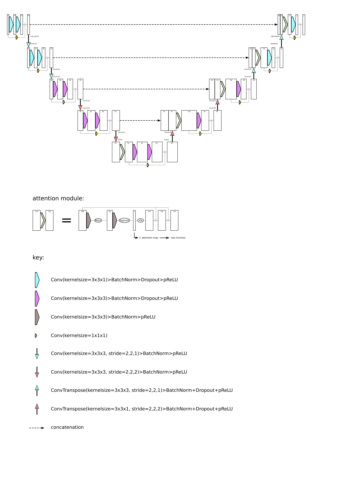

# Automatic Vestibular Schwannoma Segmentation using Deep Learning

This repository provides scripts for the segmentation of vestibular schwannoma on 3D T1 or T2 images, 
based on the following paper:

* Wang, G. et al. Automatic Segmentation of Vestibular Schwannoma from T2-Weighted MRI by Deep 
Spatial Attention with Hardness-Weighted Loss, MICCAI, pp 264-272, 2019.

## Model

The implementation is based on [MONAI](https://monai.io/) and the network has a couple of differences
compared to the network described in the paper:

- the inputs and outputs of the two convolution+PRelu+BatchNorm modules that are found in each 
layer are connected via a residual connection

- the downsampling is achieved by convolution with kernel_size=3 and stride=2, not by 
maxpooling.

- each convolution (except from the convolutions of the attention module) has a dropout layer
following the PRelu activation

##  Requirements

The following setup has been tested on Ubuntu 20.04.

* A CUDA compatible GPU with memory not less than 4GB is recommended.
* [CUDA Toolkit](https://developer.nvidia.com/cuda-toolkit). Suggested version 10.2 or above.
* [cuDNN](https://developer.nvidia.com/cudnn). Suggested version 7.6.5 or above.

* Python. Suggested version is 3.6.

* [PyTorch](https://pytorch.org/get-started/locally/) (recommended 1.6.0)

        pip install torch
    
* [MONAI](https://monai.io/) The code has been tested with github commit 0d197e which can be installed with:

        pip install git+https://github.com/Project-MONAI/MONAI.git@0d197e6bea9dd2244c63b80a80b464ef23a5aab9

* natsort (recommended: 7.0.1)

        pip install natsort      

* matplotlib (recommended: 3.3.1)

        pip install matplotlib
        
* nibabel (recommended: 3.3.1)

        pip install nibabel
        
## How to store/access the data
After downloading the repository VS_Seg, create a folder VS_Seg/data and place your data in it, 
e.g. the folder VS_T2_crop which contains image files (vs_gk_<case_number>_t2.nii.gz) and corresponding 
label files (vs_gk_<case_number>_t2_seg.nii.gz)

In case, the folder structure or file names are different from the suggested one, or to exclude cases follow
these instructions:

Open VS_Seg/Params/VSparams.py and make sure the function `load_T1_or_T2_data` returns `train_files, val_files, 
test_files`where each of the returned variables is a list of dictionaries. Each dictionary represents an
image/label pair, where the key "image" corresponds to the path to the image file and the key "label"
corresponds to the path to the label file. `train_files` contains all dictionaries of paths to the training 
images/labels, `val_files`to the validation images/labels and `test_files` to the testing images/labels.
  
# How to train
To start training, run the following command from a terminal in the VS_Seg repository:

        python3 VS_train.py --results_folder_name $RESUlTS_FOLDER_NAME 2> train_error_log.txt

This script will create the folder VS_crop/model/results/<RESULTS_FOLDER_NAME> and the three sub-folders

* figures &#10230; will contain after training is completed:

    - a png file of a central slice (center of mass slice of label) of the first
training set image after all pre-processing transformations have been applied to it, i.e. the way it is 
passed into the neural network, and the corresponding label 
    - a png file showing training curves mean loss vs. epoch number and mean validation dice score vs. 
    epoch number
    
* logs &#10230; contains the full training log (training_log.txt). Can be used to track training process 
during training.

* model &#10230; stores the model that performed best on the validation set (best_metric_model.pth)

Additionally, all output and error messages are logged in VS_Seg/train_error_log.txt

All model and optimizer parameters can be changed in the `__init__` function of class VSparams in
VS_Seg/Params/VSparams.py

# How to test
To start the training run the following command from a terminal in the VS_Seg repository:

        python3 VS_inference.py --results_folder_name $RESUlTS_FOLDER_NAME 2> inference_error_log.txt

optional parameters:

`--no_attention` removes attention module from neural network and attention maps from loss function

`--no_hardness` removes voxel hardness weighting from loss function

`--dataset T1` or `--dataset T2` to select the T1 or T2 dataset (default: T1)

<RESUlTS_FOLDER_NAME> has to match the name chosen in the training command.
The script will create in the folders:
* figures &#10230; one png file per image in the test set showing the centre of mass slice (based 
on ground truth label) with ground truth label and predicted label
* logs &#10230; test_log.txt contains individual and mean dice scores of test set

Additionally, all output and error messages are logged in VS_Seg/inference_error_log.txt

